# Simple-DNS-Relay

## Features
* 拓展性强：结构化的编程，支持A、AAAA、TXT、SOA、NS、CNAME、PTR反向查询、MX、SRV等类型的解析与处理
* ID转换表：O(1)复杂度的超时失效机制
* Cache机制：字典树 + LRU，复杂度O(1)
* Table转换表：字典树，复杂度O(1)
* 多用户并发：
    * sendto、recvfrom单线程非阻塞版本
    * select单线程多路复用版本
    * 效果：一小时；8000+高负载查询稳定运行，CPU接近0%（select）
* nslookup、dig、wireshark测试
* 多参数支持，命令行支持完善

## 1 系统的功能设计
### 1.1 功能概述

DNS（Domain Name System，域名系统），因特网上作为域名和IP地址互相映射的一个分布式数据库，能够使用户更方便的访问互联网，而不用去记住能够被机器直接读取的IP数串。通过主机名，最终得到该主机对应的IP地址的过程叫做域名解析（或主机名解析）。DNS协议运行在UDP协议之上，使用端口号53。

对于每一级域名长度的限制是63个字符，域名总长度则不能超过253个字符。

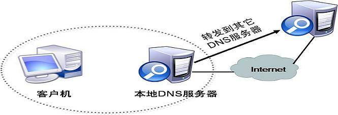

* 设计一个DNS服务器程序，读入“域名-IP地址”对照表（一个文件），当客户端查询域名对应的IP地址时，用域名检索该对照表，得到三种检索结果：
    * 不良网站拦截功能：检索结果为ip地址0.0.0.0，则向客户端返回“域名不存在”的报错消息
    * 服务器功能：检索结果为普通IP地址，则向客户返回这个地址
    * 中继功能：表中未检到该域名，则向因特网DNS服务器发出查询，并将结果返给客户端
### 1.2 功能分析和设计

#### 1.2.1 DNS服务功能

将计算机的DNS服务器地址指向本机，当用户通过域名查询ip时，DNS服务器就从本地储存的域名-ip映射表和高速缓存（Cache）中进行查询，将查询到的IP地址返回给用户，从而通过IP地址进行网页访问。

#### 1.2.2 DNS中继服务功能

当本地DNS服务器的域名-IP对照表中没有存储所需转换的域名是，就向外部DNS服务器发出查询请求，并将查询到的结果返回给客户端，同时加入到本地服务器的cache中便于下次查找使用。

#### 1.2.3 DNS屏蔽功能

当检索对照表得到ip地址为0.0.0.0时，将返回信息的RCODE（Response code）设置为Name Error(1)，表示域名不存在，并求ANCOUNT设置为0，表示没有回答。

### 1.3 需求分析

#### 1.3.1 多客户端并发处理

允许多个客户端（可能会位于不同的多个计算机）的并发查询，即：允许第一个查询尚未得到答案前就启动处理另外一个客户端查询请求。

故而需要利用DNS协议头中ID字段，进行消息ID的转换，区分不同的用户。

同时需要考虑socket编程中的阻塞模式，使得DNS服务器能够接受多用户请求而不被阻塞。

#### 1.3.2 超时处理

由于UDP的不可靠性，考虑求助外部DNS服务器（中继）却不能得到应答或者收到迟到应答的情形，故而设置超时阈值判断外部请求是否超时。当一个DNS本地服务器向外部DNS服务器发出请求时，设置一个最长等待时间，当超过此时间，就将此ID从ID转换表中删除，并向客户端发送anCount=0的回答报文。

## 2 模块划分

### 2.1调试信息模块

我们设置了功能完善的参数，如下所示：

* -d 输出调试信息
* -h 输出帮助信息
* -l 输出日志
* -f [db-file] 指定转换表文件
* -p [port] 指定监听端口
* -s [serverAddr] 外部服务器地址

运行程序打印如下：

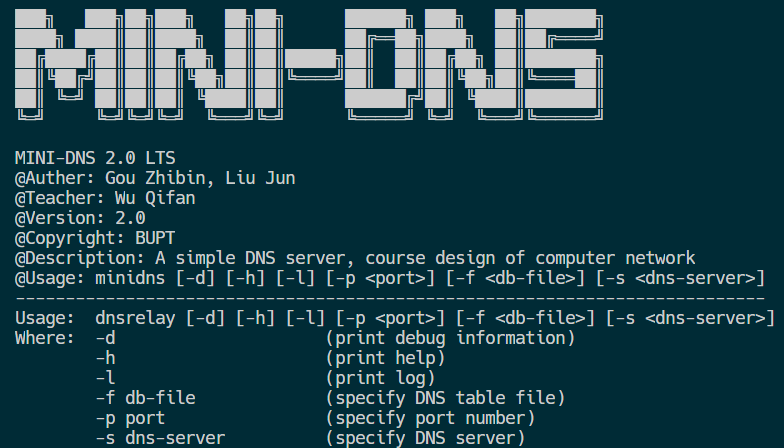

### 2.2 DNS数据包解析模块

#### 2.2.1 模块功能：

对受到的DNS数据包进行解析，根据DNS协议将数据包转换为我们定义的Message结构体（便于调用操作），然后在根据不同Type类型进行处理，最后再将Message对象转换成DNS数据包转发给客户端或者外部服务器。

#### 2.2.2 模块原理：

    * DNS协议数据包格式

整体格式

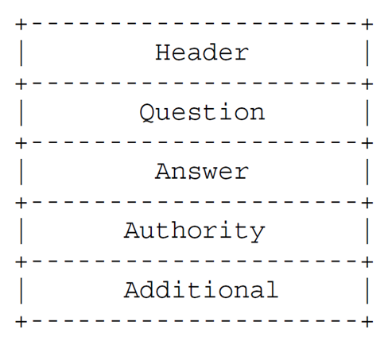

头部格式

## 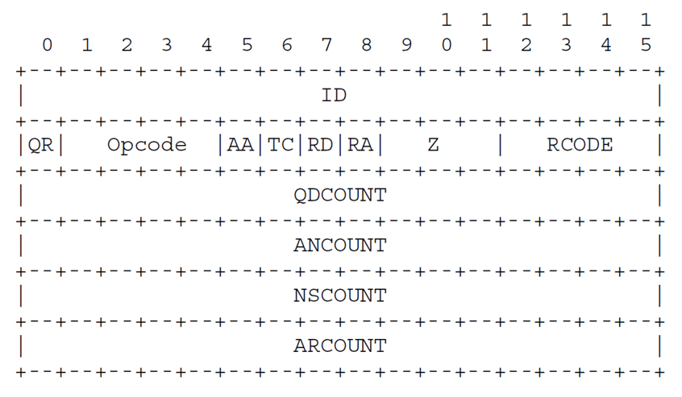

资源记录格式

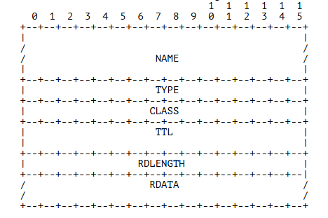

#### 2.2.3 模块实现：

    * DNS服务器基本功能实现：

DNS中继服务器的第一个功能就是按照本地的域名-IP表将用户查询域名对应的IP地址返回给用户。首先，DNS服务器通过读取cache查看是否在cache中存在此域名记录，若存在，直接返回此域名对应的IP地址；否则继续在本地的dnsrelay.txt文件中查找是否有对应的记录，如果本地数据有记录是，服务器将直接将目的地IP地址提供给客户端，从而为用户提供有效的域名解析服务。如果本地没有查询到，则交给DNS中继功能实现向外部服务器转发的操作。

    * 不良网站屏蔽功能实现：

此功能是为了拦截管理员设置的不良网站域名。管理员用户一开始时将需要拦截的网站IP设置为“0.0.0.0”，储存在本地的域名-IP表中。在从本地表读出数据，且用户访问的域名对应IP为“0.0.0.0”时，服务器会对用户访问的域名进行拦截，将返回信息的RCODE（Response code）设置为Name Error(1)，表示域名不存在，并将ANCOUNT设置为0，表示没有回答。同时会在服务器控制台中打印相应的屏蔽信息。

    * 中继功能实现

当在cache和本地域名-IP表中无法找到所需查询的域名IP时，需要向外部服务器进行询问。DNS中继服务器向因特网DNS发出查询请求，以获得域名解析信息。默认的外部DNS服务器地址是北邮的DNS服务器IP“10.3.9.4”，可通过命令行参数进行修改。

实现功能示意图如下。

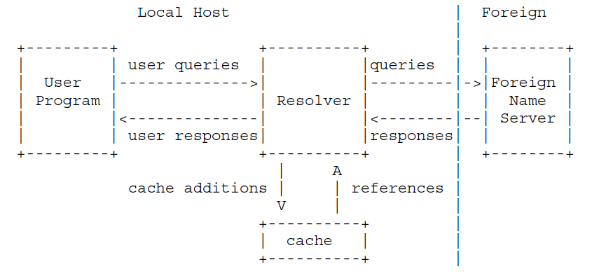

    * 多客户端并发和超时处理的实现

**多客户端并发**

在实现中继功能时，考虑到要实现应答多客户端的请求，我们得进行头部ID的转换。因为每个客户端发来的DNS询问报文都是根据本地数据进行编号的，我们在转发给外部DNS服务器时，得按照DNS中继服务器的规则进行编号，并把旧ID和新ID的转换关系储存到本地的ID转换表中。在接受到外部服务器返回的DNS报文时，通过ID转换表，将ID转换为之前客户端发来的ID，再将报文转发给客户端。

实现功能示意图如下。

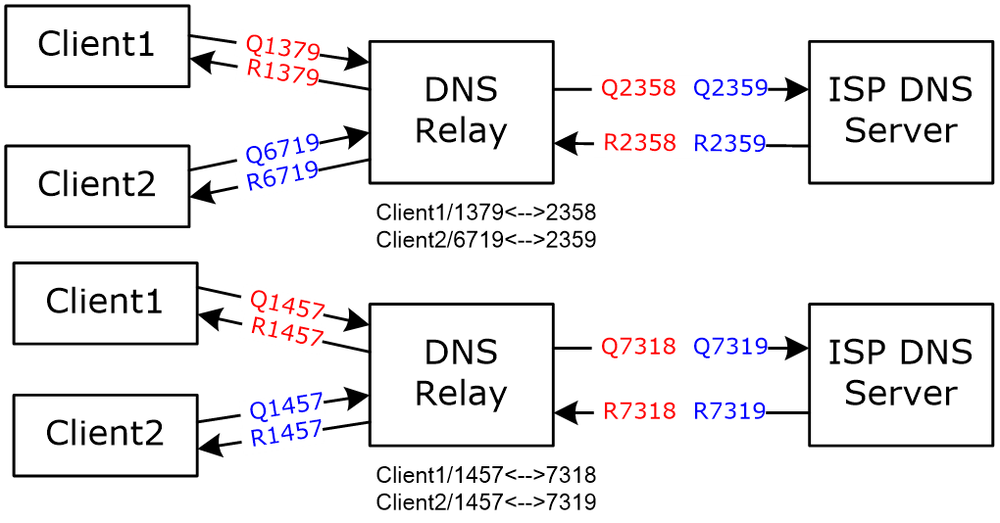

同时，如果用常规的socket编程，在调用recvFrom函数时会发生阻塞，只有等收到数据后程序才会接着运行。这样的效率会很低，并且无法实现多用户并发查询。

于是我们通过查阅资料，得到了两种解决方案

1. 使用非阻塞的socket

在使用非阻塞的socket时，无论recvFrom函数是否收到数据，直接就返回让程序继续执行，并且操作简单，只需加上两行代码即可。

ioctlsocket(clientSock,FIONBIO, (u_longFAR*)&nonBlock);

ioctlsocket(serverSock,FIONBIO, (u_longFAR*)&nonBlock);

根据我们的研究，非阻塞版本的IO存在两个问题，一是非阻塞IO在while循环中需要不断地去询问内核数据是否就绪，这样会导致CPU占用率非常高，因此一般情况下很少使用while循环这种方式来读取数据。二是虽然在recvfrom()之后进程马上能处理下一行代码，但是你不知道你的消息是否读完了，会产生所谓的“半包问题”。


2. 使用select实现I/O 多路复用

I/O 多路复用技术是为了解决进程或线程阻塞到某个 I/O 系统调用而出现的技术，使进程不阻塞于某个特定的 I/O 系统调用。

select模型基于select函数，select函数定义如下：

intselect(intmaxfdp,fd_set*readfds,fd_set*writefds,fd_set*errorfds,structtimeval*timeout);

将所需监听的socket放入fd_set，并设置一个超时等待时间，若果超过时间就自动返回，再通过FD_ISSET宏依次判断每个socket是否在fd_set集合中，如果在集合里，就调用该socket的recvfrom函数进行数据读入。

相比非阻塞模型，select模型占用的资源更少

但select也存在一些缺点，比如每次调用 select()，都需要把 fd 集合从用户态拷贝到内核态，这个开销在 fd 很多时会很大，同时每次调用 select() 都需要在内核遍历传递进来的所有 fd，这个开销在 fd 很多时也很大。同时select能同时监听的socket数量也存在上限，windows下最多同时监听64个socket。


**超时处理**

我们设置了一个ID转换表的结构体，其中有expireTime参数，每次创建ID的时候设置一个“未来超时时间”，这样可以实现O(1)时间复杂度的失效机制，避免了遍历的低效率。

```c++
typedef struct {
    uint16_t clientId;
    int expireTime; // time IdConversion expired
    struct sockaddr_in clientAddr;
} IdConversion;
```
##### 2.2.4 模块主要函数**:**

①size_tget8bits(constuint8_t**buffer);

函数说明：用于从接收到的DNS报文buffer中返回一个8bit的数据并转换为host顺序，且让buffer指针+1。类似的我们还创建了get16bits，get32bits函数，分别用于获得16bit数据和32bit数据。

②voidput8bits(uint8_t**buffer,uint8_tvalue);

函数说明：用于将一个8bit的数据value拷贝到创建的DNS报文中并将数据转换为net顺序，且让buffer指针+1。类似的我们还创建了put16bits,put32bits函数，分别用于拷贝16bit数据和32bit数据

③voidreceive_from_client();

函数说明：用于接受客户端的DNS请求，解析并分析DNS报文。

④voidreceive_from_server();

函数说明：用于接受外部DNS服务器的DNS应答，解析并分析DNS报文。

⑤intencode_msg(structMessage*msg,uint8_t**buffer);

函数说明：用于将我们定义的Message结构体转换为DNS报文。

⑥intdecode_msg(structMessage*msg,constuint8_t*buffer,intsize);

函数说明：用于将接受DNS报文转换为自定义结构体Message。

⑦uint16_tnewId(uint16_tclientId,structsockaddr_inclientAddr);

函数说明：用于将DNS查询报文的ID转换为DNS中继服务器的ID，同时更新新旧ID映射表，删除已经超时的ID，返回值为新的ID。

⑧voidfree_resource_records(structResourceRecord*rr)；

函数说明：用于释放资源记录结构体的内存，类似的释放内存的函数还有free_questions

### 2.3 域名-IP表存储和查找模块

#### 2.3.1 模块功能：

此模块负责实现本地域名-IP表的存储和查找，从而判断所需解析域名对应的ip地址是否存在本地，并且判断是否需要使用屏蔽功能。

#### 2.3.2 模块实现：

域名-IP的底层是一棵字典树，能够快速的对字符串进行插入、查找、删除，时间复杂度都是O(1)，只与字符串长度有关，并其他数据结构性能更优(如map查询、插入功能的复杂度都是Ologn)。

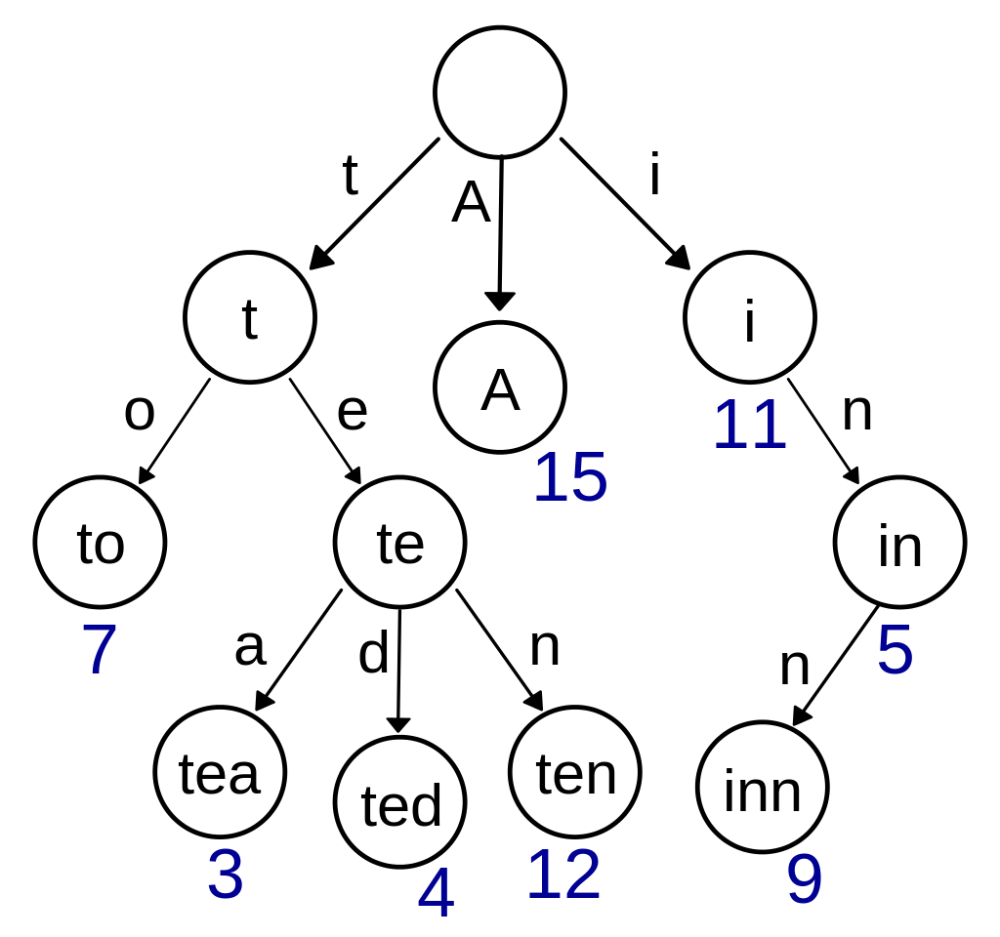

字典树示例图

#### 2.3.3 模块主要函数：

①voidinsertNode(structTrie*trie,constchar*str,unsignedcharip[4]);

函数说明：用于向字典树trie中插入一个域名-IP表项

②voiddeleteNode(structTrie*trie,char*str);

函数说明：用于字典树trie中域名为str的节点

③intfindNode(structTrie*trie,constchar*str);

函数说明：返回字典树trie，域名为str的节点ID

④boolfindInTable(unsignedcharipAddr[4],constchardomain[]);

在tableTrie中查找域名为domain的节点，如果在字典树中找到了，将Ip地址赋值到字符数组ipAddr中，并返回true。否则返回0。

### 2.4 高速缓存Cache模块

#### 2.4.1 模块功能：

此模块负责实现cache功能，包括cache的存储和替换方式。

#### 2.4.2 模块原理：

高速缓存（cache）的设计是为了提高DNS服务器的查找效率。根据局部性原理，我们设计了一定大小容量的高速缓存，里面记录了域名与IP的一对一映射。当DNS中继服务器接收到外部DNS服务器返回的DNS报文时，便将域名和IP的对应关系保存到cache中，若以后又收到相同的域名请求，就直接将Cache中的记录返回给客户端。

#### 2.4.3 模块实现：

    * cache的存储实现：

cache的存储也采用字典树数据结构，实现时间复杂段为O(1)的查找、插入、和删除操作。

    * cache的替换实现：

此模块采用了LRU（Least Recently Used）替换算法。因为实际服务器的缓存容量有限，当缓存记录已满又有新的缓存需要添加时，需要替换掉其中一条记录。此时，我们根据LRU算法替换掉最近使用的对应记录，根据研究和测试，我们发现该算法能够较大的增加Cache命中率并提升程序效率。LRU算法是通过链表实现的，插入和删除的时间复杂度都是O(1)，查找的时间复杂度是O(n)，由于Cache的容量设置不大，Cache运行效率是相当高的。

#### 2.4.4 模块主要函数：

①boolfindInCache(unsignedcharipAddr[4],constchardomain[]);

在cacheTrie中查找域名为domain的节点，如果在字典树中找到了，将Ip地址赋值到字符数组ipAddr中，对cache进行更新，并返回true。否则返回0。

②voidprintCache();

函数说明：用于打印cache中的内容

③voidupdateCache(unsignedchar*ipAddr,constchardomain[]);

函数说明：通过LRU算法来更新cache。

## 3 软件模块图

### 主框架结构

## 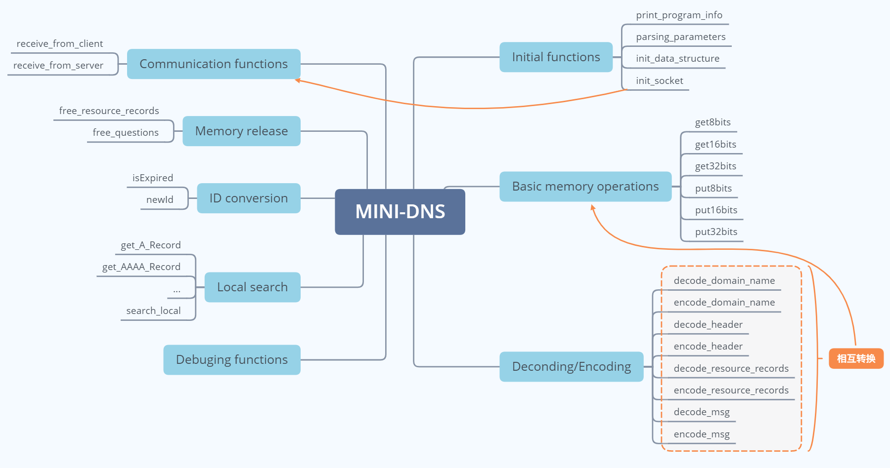

### Cache与Table算法实现

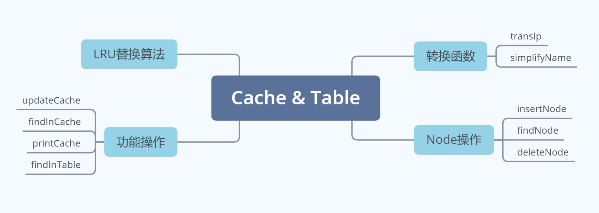

## 4 测试用例以及运行结果

我们通过脚本让服务器一秒受到大量DNS报文（大于100），服务器也能正常运行。如下图，（第二个数据表示时间）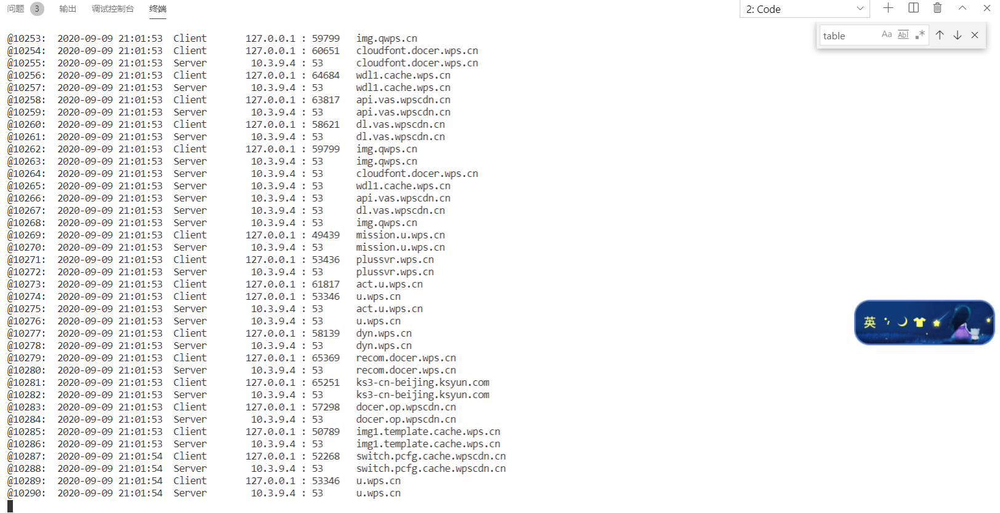

## 5 References
- RFC1035
- https://github.com/mwarning/SimpleDNS
